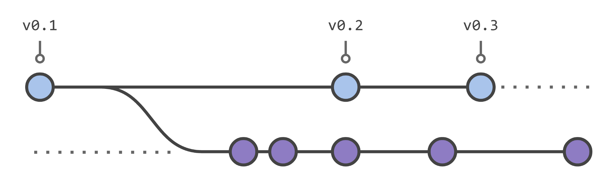
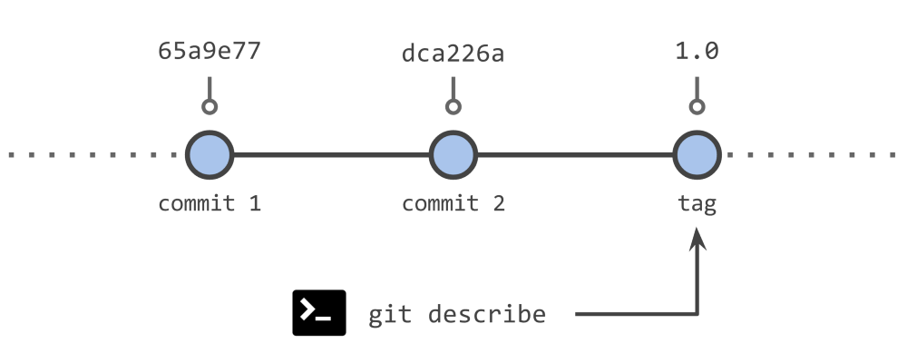
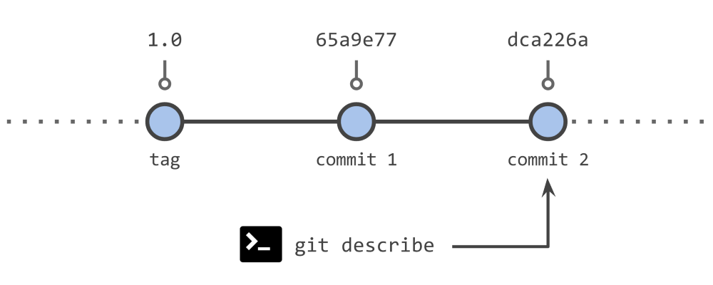
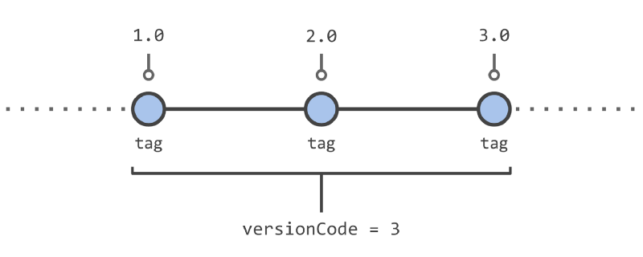
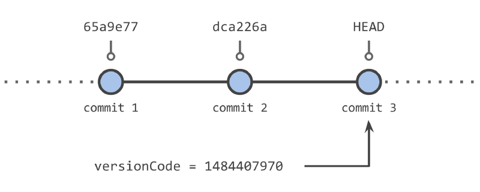

# Gradle: 通过Git自动生成版本信息

------

在开发中我们经常需要给发布的程序编写一个版本名称，以Android为例，每个应用都有一个 `VersionName`和`VersionCode`。`VersionName`是一个显示给用户的版本名，`VersionCode`是一个整数，作为程序版本新旧的判断依据，数值越大表示版本越新。最原始的方法是，在程序发布时手动更改这两个信息，但是这样做有很多缺点，很不方便：

- 不能通过`VersionCode`和`VersionName`来定位程序在git中的commit
- 如果需要更改版本，必须修改`build.gradle`

实际上，如果我们使用git作为版本控制系统，那么git可以帮助我们来自动生成这些版本信息。通常情况，我们将git的tag作为发布的版本：



### Version Name

我们可以通过`git describe` 命令来生成版本名：

- 这个命令会从当前的commit往前找到最近的一个tag
- 如果这个tag就是指向当前的commit，那么`git describe` 就返回tag的名称
- 否则会在tag中加入commit number和commit hash id的后缀

**例1：Version Name为1.0**



**例2：Version Name为1.0-2-gdca226a**



其中1.0为tag名称，2表示该commit到tag增加的次数，gdca226a是该commit的hash code

通过这个信息，我们可以很容易的找到对应的commit版本。

### **Version Code**

由于新版本的`VersionCode` 应该总是大于旧版本，因此我们可以使用总的tag数来作为`VersionCode` 。

**例3：Version Code为3**



但是这个方式仅适用于发布版本，如果我们想要一个中间版本或者开发版本，我们可以使用timestamp时间戳来作为`VersionCode` 。

**例4：Version Code为1484407970**



timestamp是从1970-1-1 00:00:00到当前时间的秒数，因此可以保证新版本总是大于旧的版本。并且，也可以很容易的根据timestamp的值换算成实际时间并定位到相应的commit版本。

### Grgit

在Gradle中, 我们可以使用一个现成的库 [*grgit*](https://github.com/ajoberstar/grgit)来完成上述的功能，只需要在gradle文件中加入以下的内容：

```groovy
buildscript {
    dependencies {
        classpath 'org.ajoberstar:grgit:1.5.0'
    }
}

import org.ajoberstar.grgit.Grgit

ext {
    git = Grgit.open(currentDir: projectDir)
    gitVersionName = git.describe()
    gitVersionCode = git.tag.list().size()
    gitVersionCodeTime = git.head().time
}
```

最后，我们只要使用`gitVersionName`，`gitVersionCode` ，`gitVersionCodeTime` 来代替原本的`versionName` 和 `versionCode` 就可以了。

这样，我们就一劳永逸的解决的版本号的管理问题：

- 不需要每次发布时更改build.gradle文件，versionName和versionCode会自动的根据当前的tag和commit的情况来生成他们
- 对于一个特定的versionName或verisonCode，我们可以很容易的定位到对应的commit，以便排查问题


